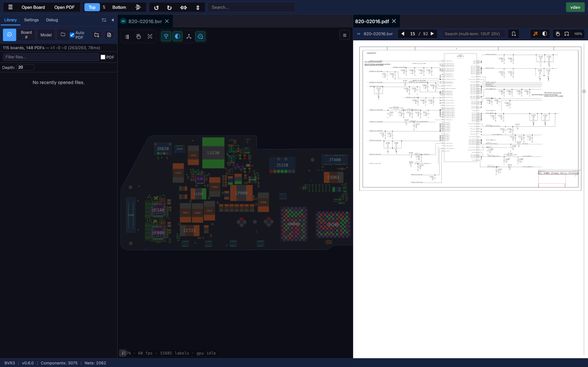
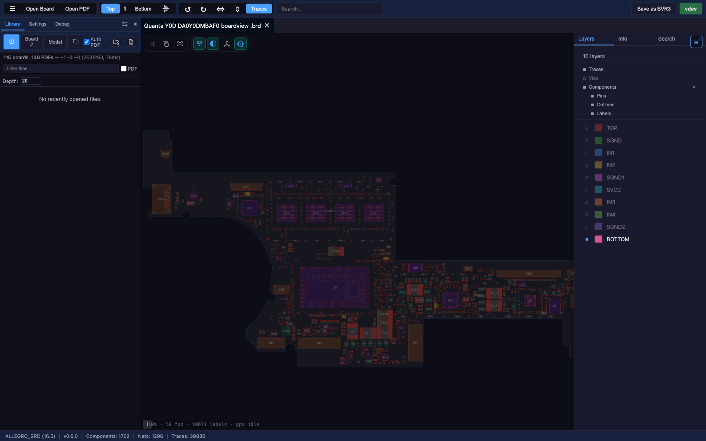
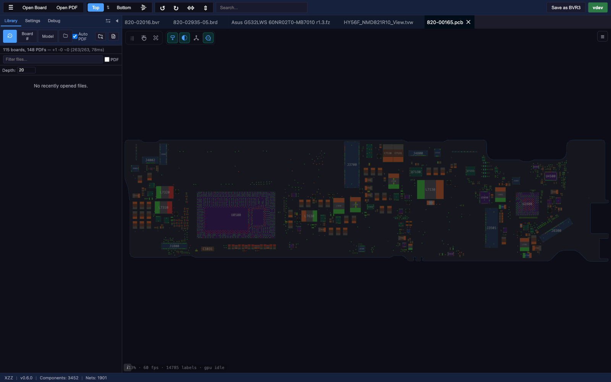
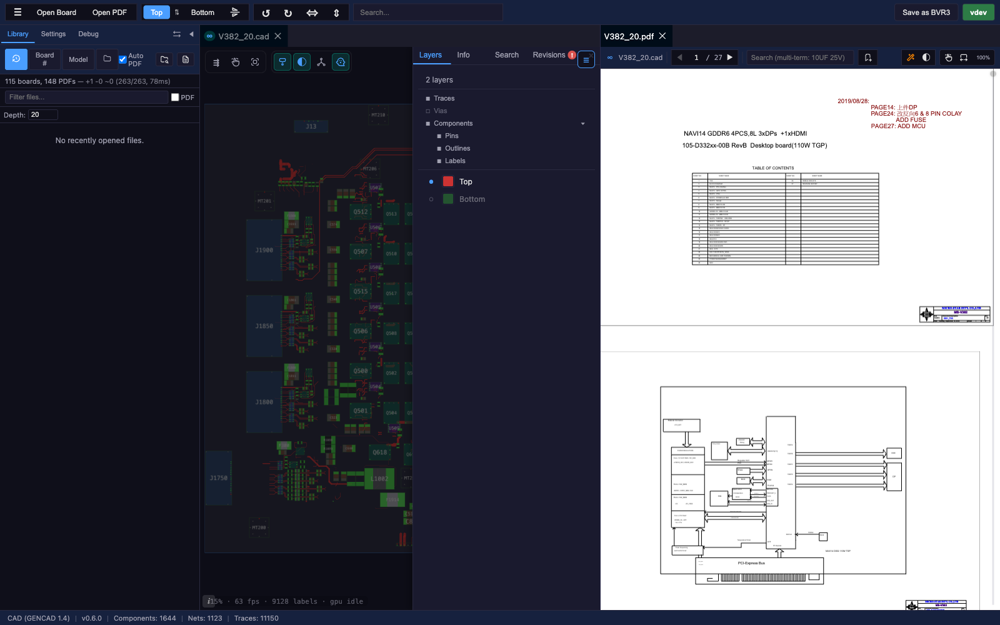

# BoardRipper

Web-based PCB boardview file viewer and inspector for board-level repair. GPU-accelerated WebGL rendering of 9 board formats with integrated PDF schematics viewer, dockable panel system, and board library — all in a ~15MB Docker image with self-update.



## Features

- **GPU-accelerated rendering** — PixiJS v8 (WebGL), handles 10,000+ components at 60fps
- **9 board formats** — BVR1, BVR3, BRD (Apple), FZ (ASUS), CAD (GenCAD), BDV, XZZ, TVW (Teboview), Allegro BRD
- **Pan & zoom** — mouse wheel, drag, pinch-zoom, deceleration, fit-to-board
- **Multi-board tabs** — open multiple boards simultaneously, switch between them
- **Layer toggle** — show/hide top and bottom layers independently
- **Butterfly mode** — side-by-side mirrored view of both board sides
- **Selection & highlight** — click component or pin to highlight entire net across the board
- **Net lines** — show connection lines between components sharing a net
- **Search** — find components and nets by name with instant results
- **Context menu** — right-click to copy name, highlight net, search in PDF



- **Panel system** — Dockview: dockable, floating, and popout-to-new-window panels
  - Component Info (pins list, metadata)
  - Net List (searchable, click to highlight)
  - Search Results
  - PDF Viewer (pan/zoom, text search, bookmarks, night mode)
  - Settings (live preview mockup, per-net color rules, label/pin/outline tuning)
  - Debug Panel (scoped log viewer)
- **Board library** — scan folders, browse by board number or model, auto-link PDFs to boards
- **Board database** — ODM-aware resolution engine, maps board numbers to manufacturers/models
- **Self-update** — check for updates from the UI, one-click Docker container update via Docker socket
- **Electron desktop app** — standalone macOS (universal + legacy) and Windows builds
- **IndexedDB cache** — instant re-open without re-parsing



## Supported File Formats

| Format | Description | Spec |
|--------|-------------|------|
| **BVR1** | Tab-delimited, absolute coordinates ×1000 | [BVR_FORMAT.md](docs/formats/BVR_FORMAT.md) |
| **BVR3** | Keyword-value, relative pin coordinates | [BVR_FORMAT.md](docs/formats/BVR_FORMAT.md) |
| **BRD** | Binary obfuscated boardview (Apple/Mac repair) | [BRD_FORMAT.md](docs/formats/BRD_FORMAT.md) |
| **BDV** | Plain-text boardview (BRDOUT/NETS/PARTS/PINS/NAILS) | [BDV_FORMAT.md](docs/formats/BDV_FORMAT.md) |
| **FZ** | ASUS boardview (RC6-encrypted, zlib-compressed) | [FZ_FORMAT.md](docs/formats/FZ_FORMAT.md) |
| **CAD** | GenCAD 1.4 text-based PCB interchange | [CAD_FORMAT.md](docs/formats/CAD_FORMAT.md) |
| **XZZ** | XZZ PCB (DES-encrypted boardview) | [XZZ_FORMAT.md](docs/formats/XZZ_FORMAT.md) |
| **TVW** | Teboview binary (multi-layer, traces, drill data) | [TVW_FORMAT.md](docs/formats/TVW_FORMAT.md) |
| **Allegro BRD** | Cadence Allegro binary PCB (v16.0–17.4) | [ALLEGRO_BRD_FORMAT.md](docs/formats/ALLEGRO_BRD_FORMAT.md) |



## Stack

| Layer | Technology |
|---|---|
| Rendering | PixiJS v8 + pixi-viewport v6 |
| Frontend | React 19 + TypeScript + Vite 7 |
| Panels | Dockview v5 |
| Backend | Go (net/http stdlib) |
| Container | Docker multi-stage, scratch-based |
| Desktop | Electron (macOS universal + Windows) |
| Tests | Playwright (Chromium headless) |

## Quick Start

BoardRipper is primarily a **server** you run on a NAS or host machine and
access from any browser on your network. Standalone binaries and desktop
Electron wrappers are available as alternatives.

### Docker (typical deployment)

```bash
docker compose up --build -d
# → http://localhost:8081
```

Mount your board-file folders under `/library` to expose them in the Library
panel — see the Docker Setup section below.

### Standalone binary

```bash
# Download boardripper-<platform>-<version>.tar.gz from GitHub Releases, then:
tar -xzf boardripper-<platform>-<version>.tar.gz
STATIC_DIR=./static DATA_DIR=./data ./boardripper
# → http://localhost:8080

# Windows:
# Unzip, then: set STATIC_DIR=static& set DATA_DIR=data& boardripper.exe
```

### Development

```bash
# Frontend (hot reload)
cd src/frontend && npm install && npm run dev    # http://localhost:5173

# Backend (separate terminal)
cd src/backend && go run .                       # http://localhost:8080
```

## Docker Setup

### docker-compose.yml

```yaml
services:
  boardripper:
    image: boardripper:latest    # or build: .
    ports:
      - "8081:8080"              # access at http://your-host:8081
    volumes:
      - ./data:/data             # uploaded board files persist here
      # Mount your board file folders as subdirectories of /library:
      - /path/to/MacBooks:/library/MacBooks:ro
      - /path/to/iPhones:/library/iPhones:ro
      - /path/to/Schematics:/library/Schematics:ro
      # Each mount appears as a top-level folder in the Library browser.
      # Docker socket (required for self-update):
      - /var/run/docker.sock:/var/run/docker.sock
    environment:
      - PORT=8080
      - GITHUB_TOKEN=${GITHUB_TOKEN:-}   # GitHub PAT for update checking (private repo)
    restart: unless-stopped
    deploy:
      resources:
        limits:
          memory: 512M
```

### Volume Mounting

The Library panel browses the `/library` directory inside the container. Mount your board file folders as **subdirectories** of `/library` to see them in the browser:

```
-v /nas/boards/MacBooks:/library/MacBooks:ro
-v /nas/boards/iPhones:/library/iPhones:ro
-v /nas/schematics:/library/Schematics:ro
```

These will appear as top-level folders (`MacBooks/`, `iPhones/`, `Schematics/`) in the Library panel. Use `:ro` for read-only access.

### Synology NAS (DSM 7.2+)

1. Download `boardripper-docker-<version>.tar.gz` from [GitHub Releases](https://github.com/AlexeyInwerp/BoardRipper/releases)
2. SSH into your NAS and load the image:
   ```bash
   docker load < boardripper-docker-<version>.tar.gz
   ```
3. Create the container:
   ```bash
   docker run -d \
     --name boardripper \
     -p 8090:8080 \
     -v /volume1/docker/boardripper/data:/data \
     -v /volume1/your-boards/MacBooks:/library/MacBooks:ro \
     -v /volume1/your-boards/iPhones:/library/iPhones:ro \
     -v /var/run/docker.sock:/var/run/docker.sock \
     -e PORT=8080 \
     -e GITHUB_TOKEN=your_github_pat_here \
     --restart unless-stopped \
     boardripper:latest
   ```
4. Open `http://your-nas-ip:8090`

### Self-Update

BoardRipper can update itself when running in Docker:
1. Click the **version badge** in the toolbar to check for updates
2. If an update is available, click **Update & Restart**
3. The container pulls the new image and restarts automatically

Requires:
- Docker socket mounted (`-v /var/run/docker.sock:/var/run/docker.sock`)
- `GITHUB_TOKEN` environment variable set (for private repo access)

### Updating Manually

```bash
docker load < boardripper-docker-<new-version>.tar.gz
docker compose down && docker compose up -d
```

## Electron Desktop Wrapper (optional)

Prebuilt Electron wrappers are published with every release
(`BoardRipper-macOS-universal-<version>.zip`, `BoardRipper-Windows-x64-<version>.zip`).
They run the same Go backend + React frontend inside an Electron shell. The
Docker / server path is the primary way to deploy BoardRipper; the desktop
wrapper is here for single-machine use.

The wrappers are **unsigned**, so macOS Gatekeeper and Windows SmartScreen
will warn on first launch:

- **macOS** — after unzipping, run `xattr -cr /Applications/BoardRipper.app`
  (or wherever you extracted it), then double-click. On macOS < 15 you can
  also right-click → Open → Open once, or use System Settings → Privacy &
  Security → Open Anyway after the first failed launch.
- **Windows** — SmartScreen shows "Windows protected your PC". Click
  **More info → Run anyway**.

### Building the wrappers locally

```bash
cd desktop
npm install
node build-all.mjs           # builds macOS universal + legacy + Windows
node build-all.mjs --mac     # macOS only
node build-all.mjs --win     # Windows only
```

Output in `desktop/out/` (macOS), `desktop/out-legacy/` (macOS legacy), `desktop/out-win/` (Windows).

## License

BoardRipper is released under the **GNU Affero General Public License v3.0**
(AGPL-3.0). See [LICENSE](LICENSE) for the full text.

This project incorporates code derived from KiCad (GPL-3.0), which is why
AGPL-3.0 was chosen — it is compatible with GPL-3.0 and additionally closes
the "SaaS loophole" by requiring source availability to users who interact
with a hosted instance over a network.

For a complete list of third-party sources, libraries, and attributions, see
[THIRD_PARTY.md](THIRD_PARTY.md).
