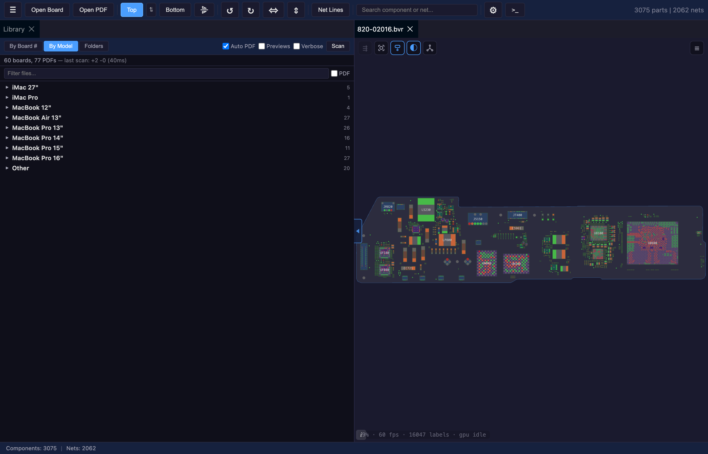
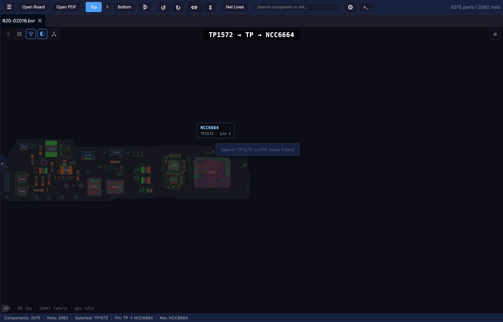
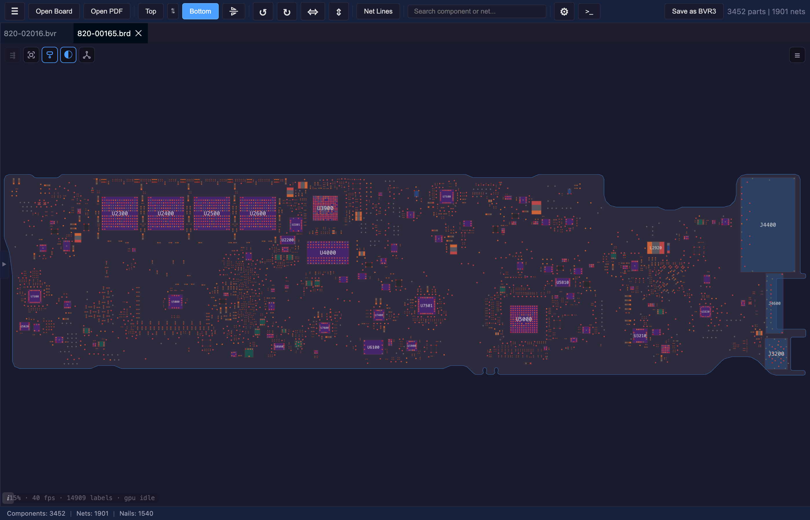

# BoardRipper

Web-based PCB boardview file viewer and inspector. GPU-accelerated WebGL rendering of 9 board formats, dockable panel system, PDF schematics viewer — all in a ~15MB Docker image.



## Features

- **GPU-accelerated rendering** — PixiJS v8 (WebGL), handles 10,000+ components at 60fps
- **9 board formats** — BVR1, BVR3, BRD (Apple), FZ (ASUS), CAD (GenCAD), BDV, XZZ, TVW (Teboview), Allegro BRD
- **Pan & zoom** — mouse wheel, drag, pinch-zoom, deceleration, fit-to-board
- **Multi-board tabs** — open multiple boards simultaneously, switch between them
- **Layer toggle** — show/hide top and bottom layers independently
- **Butterfly mode** — side-by-side mirrored view of both board sides
- **Selection & highlight** — click component or pin to highlight entire net across the board
- **Net lines** — show connection lines between components sharing a net
- **Search** — find components and nets by name with instant results
- **Context menu** — right-click to copy name, highlight net, search in PDF



- **Panel system** — Dockview: dockable, floating, and popout-to-new-window panels
  - Component Info (pins list, metadata)
  - Net List (searchable, click to highlight)
  - Search Results
  - PDF Viewer (pan/zoom, text search, bookmarks, night mode)
  - Settings (live preview mockup, per-net color rules, label/pin/outline tuning)
- **Board library** — scan folders, browse by board number or model, auto-link PDFs
- **IndexedDB cache** — instant re-open without re-parsing
- **Docker deploy** — ~15MB scratch-based image for NAS



## Supported File Formats

| Format | Description | Spec |
|--------|-------------|------|
| **BVR1** | Tab-delimited, absolute coordinates ×1000 | [BVR_FORMAT.md](docs/formats/BVR_FORMAT.md) |
| **BVR3** | Keyword-value, relative pin coordinates | [BVR_FORMAT.md](docs/formats/BVR_FORMAT.md) |
| **BRD** | Binary obfuscated boardview (Apple/Mac repair) | [BRD_FORMAT.md](docs/formats/BRD_FORMAT.md) |
| **BDV** | Plain-text boardview (BRDOUT/NETS/PARTS/PINS/NAILS) | [BDV_FORMAT.md](docs/formats/BDV_FORMAT.md) |
| **FZ** | ASUS boardview (RC6-encrypted, zlib-compressed) | [FZ_FORMAT.md](docs/formats/FZ_FORMAT.md) |
| **CAD** | GenCAD 1.4 text-based PCB interchange | [CAD_FORMAT.md](docs/formats/CAD_FORMAT.md) |
| **XZZ** | XZZ PCB (DES-encrypted boardview) | [XZZ_FORMAT.md](docs/formats/XZZ_FORMAT.md) |
| **TVW** | Teboview binary (multi-layer, traces, drill data) | [TVW_FORMAT.md](docs/formats/TVW_FORMAT.md) |
| **Allegro BRD** | Cadence Allegro binary PCB (v16.0–17.4) | [ALLEGRO_BRD_FORMAT.md](docs/formats/ALLEGRO_BRD_FORMAT.md) |

## Stack

| Layer | Technology |
|---|---|
| Rendering | PixiJS v8 + pixi-viewport v6 |
| Frontend | React 19 + TypeScript + Vite 7 |
| Panels | Dockview v5 |
| Backend | Go (net/http stdlib) |
| Container | Docker multi-stage, scratch-based |
| Tests | Playwright (Chromium headless) |

## Quick Start

### Docker (production)

```bash
docker compose up --build
# → http://localhost:8080
```

### Development

```bash
# Frontend
cd src/frontend
npm install
npm run dev       # http://localhost:5173

# Backend (separate terminal)
cd src/backend
go run .          # http://localhost:8080
```

## Deployment (NAS / Docker)

```yaml
# docker-compose.yml
services:
  boardripper:
    build: .
    ports:
      - "8080:8080"
    volumes:
      - ./data:/data
    restart: unless-stopped
```

## License

Private — not open-source.
