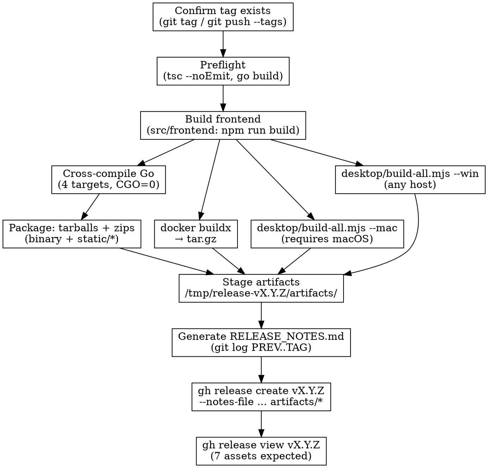

# Release Fallback — Manual Build Pipeline

Use this playbook when the **GitHub Actions release workflow cannot produce
artifacts** — most commonly because the repository has hit the free-tier
**Artifact storage quota** (message: *"Failed to CreateArtifact: Artifact
storage quota has been hit. Usage is recalculated every 6–12 hours."*).

Normal path is [`.github/workflows/release.yml`](../.github/workflows/release.yml)
triggered by pushing a `v*` tag. This doc describes how to reproduce the same
seven release assets on a local developer machine and upload them by hand.

## TL;DR — use the automated script

The whole flow below is wrapped in [`scripts/release.sh`](../scripts/release.sh).
It pushes the tag, monitors CI, detects the "storage quota" failure, and
falls back to the local build automatically:

```bash
scripts/release.sh v0.9.0              # full pipeline (preflight → CI → fallback)
scripts/release.sh v0.9.0 --resume     # tag already pushed, monitor and fall back if needed
scripts/release.sh v0.9.0 --local      # skip CI entirely, go straight to local build
```

The rest of this doc is the manual runbook for when the script itself can't
be used (e.g., debugging a failing step, running on a machine without all
the tooling).

## When to use this

- CI reports `Failed to CreateArtifact: ... quota has been hit`.
- CI reports `Unable to upload any new artifacts`.
- CI succeeds but `create-release` never runs because an upstream job
  (`build-binaries`, `build-desktop-*`, `build-docker`) failed.
- You need a release urgently and can't wait 6–12 h for the quota window.
- You're running a private fork without GitHub Actions minutes.

Do **not** use this if CI is only failing on lint/type/test — fix the code,
re-tag, and let CI run normally. The fallback is only for infrastructure
failures.

## Prerequisites

| Tool              | Why                                            |
|-------------------|------------------------------------------------|
| Node 20 + npm     | Frontend + Electron builds                     |
| Go 1.22+          | Server binaries                                |
| Docker + buildx   | Server container image                         |
| `gh` CLI (auth'd) | Upload the release                             |
| zip, tar, gzip    | Packaging (all platforms)                      |
| macOS host        | Only way to build the signed macOS `.app`      |

> The Windows Electron app is cross-compiled from any host. Only the macOS
> Electron app genuinely requires running on darwin.

## Expected release assets (seven files)

What `create-release` in the workflow would upload:

| Asset                                         | Source workflow job      |
|-----------------------------------------------|--------------------------|
| `boardripper-docker-vX.Y.Z.tar.gz`            | `build-docker`           |
| `boardripper-linux-amd64-vX.Y.Z.tar.gz`       | `build-binaries`         |
| `boardripper-macos-amd64-vX.Y.Z.tar.gz`       | `build-binaries`         |
| `boardripper-macos-arm64-vX.Y.Z.tar.gz`       | `build-binaries`         |
| `boardripper-windows-amd64-vX.Y.Z.zip`        | `build-binaries`         |
| `BoardRipper-macOS-universal-vX.Y.Z.zip`      | `build-desktop-mac`      |
| `BoardRipper-Windows-x64-vX.Y.Z.zip`          | `build-desktop-win`      |

## Pipeline



## Step-by-step

Set `VERSION` once — every command below assumes it's exported.

```bash
export VERSION=v0.8.0        # change per release
export STAGE=/tmp/release-$VERSION
mkdir -p "$STAGE/artifacts"
```

### 1. Confirm the tag is on GitHub

The release is attached to a tag, so the tag must exist remotely before you
can upload assets.

```bash
git tag "$VERSION" 2>/dev/null || true       # noop if already tagged
git push origin main "$VERSION"
```

If CI failed **after** a previous tag push, the tag is already remote — no
action needed.

### 2. Preflight (same as CI `validate`)

```bash
# Frontend: lint + typecheck
cd src/frontend
rm -f tsconfig.tsbuildinfo tsconfig.app.tsbuildinfo
npx eslint . --max-warnings 80
npx tsc -b --noEmit

# Backend
cd ../../src/backend
go build ./...
cd ../..
```

If any step fails, fix and **re-tag** — don't try to ship a broken build.

### 3. Frontend dist (shared by all targets)

```bash
cd src/frontend
npm run build    # writes dist/
cd ../..
```

### 4. Go server binaries (4 platforms)

All four binaries share the same frontend dist.

```bash
cd src/backend
LDFLAGS="-s -w -X boardripper/updater.Version=$VERSION"

CGO_ENABLED=0 GOOS=linux   GOARCH=amd64 go build -ldflags="$LDFLAGS" -o "$STAGE/boardripper-linux-amd64" .
CGO_ENABLED=0 GOOS=windows GOARCH=amd64 go build -ldflags="$LDFLAGS" -o "$STAGE/boardripper-windows-amd64.exe" .
CGO_ENABLED=0 GOOS=darwin  GOARCH=amd64 go build -ldflags="$LDFLAGS" -o "$STAGE/boardripper-macos-amd64" .
CGO_ENABLED=0 GOOS=darwin  GOARCH=arm64 go build -ldflags="$LDFLAGS" -o "$STAGE/boardripper-macos-arm64" .
cd ../..
```

### 5. Package server bundles (binary + static/)

Each bundle contains `boardripper` (the binary) and `static/` (the frontend dist).

```bash
cd "$STAGE"
for PLATFORM in linux-amd64 macos-amd64 macos-arm64; do
  rm -rf "pkg-$PLATFORM" && mkdir -p "pkg-$PLATFORM/static"
  cp "boardripper-$PLATFORM" "pkg-$PLATFORM/boardripper"
  chmod +x "pkg-$PLATFORM/boardripper"
  cp -r "$OLDPWD/src/frontend/dist/"* "pkg-$PLATFORM/static/"
  tar -czf "artifacts/boardripper-$PLATFORM-$VERSION.tar.gz" -C "pkg-$PLATFORM" .
done

# Windows uses .zip (not tar.gz)
rm -rf pkg-windows-amd64 && mkdir -p pkg-windows-amd64/static
cp boardripper-windows-amd64.exe pkg-windows-amd64/boardripper.exe
cp -r "$OLDPWD/src/frontend/dist/"* pkg-windows-amd64/static/
(cd pkg-windows-amd64 && zip -qr "$STAGE/artifacts/boardripper-windows-amd64-$VERSION.zip" .)
cd -
```

Validate each bundle contains `boardripper` (or `boardripper.exe`) and
`static/index.html` — the CI workflow does this check explicitly.

### 6. Docker image

The `build-docker` workflow step in one line:

```bash
docker buildx build \
  --platform linux/amd64 \
  --build-arg APP_VERSION=$VERSION \
  --tag boardripper:$VERSION \
  --output type=docker,dest=$STAGE/boardripper-docker.tar \
  .
gzip -f $STAGE/boardripper-docker.tar
mv $STAGE/boardripper-docker.tar.gz $STAGE/artifacts/boardripper-docker-$VERSION.tar.gz
```

### 7. Electron apps

The desktop builds are the slowest step (~5 min each). Kick them off in
parallel in separate terminals if possible.

```bash
# macOS universal (arm64 + x64) — ONLY runs on darwin
cd desktop && node build-all.mjs --mac
cp "out/BoardRipper-macOS-universal-$VERSION.zip" "$STAGE/artifacts/"
cd ..

# Windows x64 — runs anywhere, uses electron-builder
cd desktop && node build-all.mjs --win
cp "out-win/BoardRipper-Windows-x64-$VERSION.zip" "$STAGE/artifacts/"
cd ..
```

If you're on Linux, **skip the mac build** and flag it in the release notes.
A tag-only mac release later can run `gh release upload $VERSION path/to/BoardRipper-macOS-universal-$VERSION.zip`.

### 8. Generate release notes

Matches the workflow's changelog step.

```bash
PREV=$(git describe --tags --abbrev=0 "$VERSION^" 2>/dev/null || true)
{
  echo "## BoardRipper $VERSION"
  echo
  if [ -n "$PREV" ]; then
    echo "### Changes since $PREV"
    echo
    git log --no-merges --pretty=format:'- %s' "$PREV..$VERSION" \
      | grep -Ev '^- release:|^- chore\(release\):' \
      || echo "- (no non-release commits)"
    echo
  fi
  echo
  echo "### Downloads"
  echo "- \`boardripper-docker-$VERSION.tar.gz\` — server / NAS"
  echo "- \`boardripper-{linux,macos,windows}-{amd64,arm64}-$VERSION\` — standalone"
  echo "- \`BoardRipper-macOS-universal-$VERSION.zip\` — desktop (unsigned)"
  echo "- \`BoardRipper-Windows-x64-$VERSION.zip\` — desktop (unsigned)"
} > "$STAGE/RELEASE_NOTES.md"
```

### 9. Upload via `gh release create`

```bash
cd "$STAGE"
gh release create "$VERSION" \
  --title "BoardRipper $VERSION" \
  --notes-file RELEASE_NOTES.md \
  artifacts/*
```

Use `--prerelease` for betas (`v0.8.0-beta.1`).

### 10. Verify

```bash
gh release view "$VERSION" | head -20
```

Seven assets expected. If fewer, see *Partial releases* below.

## Partial releases

If one target can't be built locally (e.g., no macOS host, Docker quota
somewhere else), ship the release with the assets you have and upload the
missing ones later:

```bash
gh release upload "$VERSION" path/to/missing-asset.zip
```

The in-app updater reads `release_info.body` + asset list from the GitHub
API, so partial releases still work — users on the missing platform just
see no download link and keep their old version.

## Gotchas

- **Tag must exist remotely before `gh release create`**, otherwise it
  returns `Error: GraphQL: Resource not found`.
- **Frontend `__APP_VERSION__`** is baked in at `vite build` time from
  `src/frontend/package.json`. Bump the package.json **before** running
  step 3, or the status bar will show the wrong version.
- **Go binary version** comes from `-ldflags "-X boardripper/updater.Version=..."`.
  If this is missing, the self-updater reports `current_version: "dev"`
  and the update UI breaks.
- **`tsconfig.tsbuildinfo` cache** hides errors CI catches. Always delete
  it before preflight (see step 2).
- **CI that appears to pass can still leave no release**. Verify with
  `gh release view "$VERSION"` — an empty result means upstream build jobs
  failed silently (usually artifact upload).
- **Re-running** the CI workflow is rarely useful if the quota is hit —
  it re-fails the upload step. Wait for quota reset or use this fallback.

## Check quota status

GitHub doesn't expose the repo's current artifact storage via API, but a
minimal proxy is: list recent workflow runs and look for the telltale
`CreateArtifact` error.

```bash
gh run list --workflow=Release --limit 5 --json conclusion,displayTitle,status
gh run view <RUN_ID> --log-failed | grep -i 'CreateArtifact\|storage quota'
```

If the quota is hit, push a new tag with no code changes won't help; wait
6–12 hours or use this manual pipeline.

## Cross-reference

- Release skill entry point: `~/.claude/skills/release/SKILL.md` (the
  happy path — uses CI).
- Fallback playbook (this file): invoked when the skill's "Monitor
  Workflow" step detects a quota failure.
- Workflow sources: [`.github/workflows/release.yml`](../.github/workflows/release.yml),
  [`.github/workflows/ci.yml`](../.github/workflows/ci.yml).
